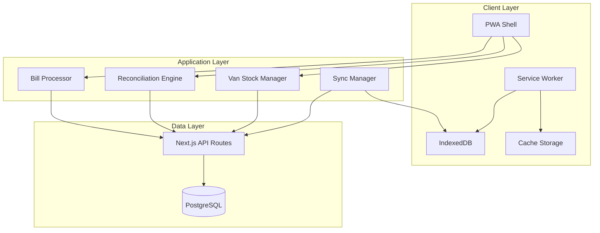

# Design Document: PWA-Enhanced Van Stock Management

## Overview

This design document outlines the technical implementation for enhancing the existing sales tracker application with Progressive Web App (PWA) capabilities and improved van stock management workflow. The enhancement will transform the current Next.js application into a fully functional PWA with offline capabilities, automatic discrepancy detection, and streamlined workflows for both Admin and User roles.

The system builds upon the existing simplified van stock management architecture that focuses on quantity tracking and reconciliation without price calculations. The PWA enhancement will enable mobile-first usage, offline functionality, and improved user experience for field operations.

## Architecture

### High-Level Architecture



### PWA Architecture Components

1. **PWA Shell**: The core application shell that provides the app-like experience
2. **Service Worker**: Handles caching, offline functionality, and background sync
3. **IndexedDB**: Client-side database for offline data storage and sync queues
4. **Cache Storage**: Stores static assets and API responses for offline access
5. **Sync Manager**: Manages data synchronization between offline and online states

### Application Layer Components

1. **Van Stock Manager**: Handles daily van stock operations and quantity tracking
2. **Reconciliation Engine**: Calculates discrepancies and generates reports
3. **Bill Processor**: Manages bill image uploads and item selection
4. **Sync Manager**: Coordinates offline data synchronization

## Components and Interfaces

### PWA Core Components

#### 1. Web App Manifest
```typescript
interface WebAppManifest {
  name: string;
  short_name: string;
  description: string;
  start_url: string;
  display: 'standalone' | 'fullscreen' | 'minimal-ui' | 'browser';
  theme_color: string;
  background_color: string;
  icons: ManifestIcon[];
  categories: string[];
  orientation: 'portrait' | 'landscape' | 'any';
}

interface ManifestIcon {
  src: string;
  sizes: string;
  type: string;
  purpose?: 'any' | 'maskable' | 'monochrome';
}
```

#### 2. Service Worker Interface
```typescript
interface ServiceWorkerConfig {
  cacheStrategy: 'CacheFirst' | 'NetworkFirst' | 'StaleWhileRevalidate';
  cacheName: string;
  urlPatterns: RegExp[];
  maxEntries?: number;
  maxAgeSeconds?: number;
}

interface SyncEvent {
  tag: string;
  data: any;
  timestamp: number;
  retryCount: number;
}
```

#### 3. Offline Storage Interface
```typescript
interface OfflineStorageManager {
  store<T>(key: string, data: T): Promise<void>;
  retrieve<T>(key: string): Promise<T | null>;
  remove(key: string): Promise<void>;
  clear(): Promise<void>;
  getAllKeys(): Promise<string[]>;
}

interface SyncQueue {
  enqueue(operation: SyncOperation): Promise<void>;
  dequeue(): Promise<SyncOperation | null>;
  peek(): Promise<SyncOperation | null>;
  size(): Promise<number>;
  clear(): Promise<void>;
}

interface SyncOperation {
  id: string;
  type: 'CREATE' | 'UPDATE' | 'DELETE';
  endpoint: string;
  data: any;
  timestamp: number;
  retryCount: number;
  maxRetries: number;
}
```

### Enhanced Van Stock Management Components

#### 1. Van Stock Manager Interface
```typescript
interface VanStockManager {
  loadDailyStock(userId: string, date: Date, items: VanLoadItem[]): Promise<void>;
  updateReturns(userId: string, date: Date, returns: VanReturnItem[]): Promise<void>;
  getStockStatus(userId: string, date: Date): Promise<VanStockStatus>;
  calculateExpectedSales(userId: string, date: Date): Promise<ExpectedSales[]>;
}

interface VanLoadItem {
  itemName: string;
  loaded: number;
  returned?: number;
}

interface VanReturnItem {
  itemName: string;
  returned: number;
}

interface VanStockStatus {
  userId: string;
  date: Date;
  items: VanStockItem[];
  totalLoaded: number;
  totalReturned: number;
  expectedSales: number;
}

interface VanStockItem {
  itemName: string;
  loaded: number;
  returned: number;
  expectedSales: number;
  actualSales: number;
  discrepancy: number;
  status: 'balanced' | 'missing' | 'excess';
}
```

#### 2. Reconciliation Engine Interface
```typescript
interface ReconciliationEngine {
  calculateDiscrepancies(userId: string, date: Date): Promise<ReconciliationReport>;
  generateReport(userId: string, date: Date): Promise<ReconciliationReport>;
  getDiscrepancyAlerts(userId: string, date: Date): Promise<DiscrepancyAlert[]>;
  validatePayments(userId: string, date: Date, payments: PaymentRecord): Promise<PaymentValidation>;
}

interface ReconciliationReport {
  userId: string;
  date: Date;
  summary: ReconciliationSummary;
  itemDetails: ItemReconciliation[];
  paymentValidation: PaymentValidation;
  discrepancies: DiscrepancyAlert[];
  status: 'balanced' | 'discrepancies_found';
}

interface ReconciliationSummary {
  totalLoaded: number;
  totalReturned: number;
  expectedSales: number;
  actualSales: number;
  totalDiscrepancy: number;
  discrepancyCount: number;
}

interface ItemReconciliation {
  itemName: string;
  loaded: number;
  returned: number;
  expectedSales: number;
  actualSales: number;
  discrepancy: number;
  discrepancyType: 'none' | 'missing' | 'excess';
}

interface DiscrepancyAlert {
  id: string;
  type: 'quantity_missing' | 'quantity_excess' | 'payment_mismatch';
  itemName?: string;
  amount: number;
  description: string;
  severity: 'low' | 'medium' | 'high';
  resolved: boolean;
}

interface PaymentRecord {
  cash: number;
  credit: number;
  cheque: number;
  total: number;
}

interface PaymentValidation {
  expectedTotal: number;
  actualTotal: number;
  discrepancy: number;
  valid: boolean;
  alerts: DiscrepancyAlert[];
}
```

#### 3. Bill Processor Interface
```typescript
interface BillProcessor {
  uploadBill(userId: string, billData: BillUpload): Promise<BillUploadResult>;
  selectItems(billId: string, selectedItems: SelectedItem[]): Promise<void>;
  getBillSubmissions(userId?: string, date?: Date): Promise<BillSubmission[]>;
  processBillImage(imageData: string): Promise<ProcessedBill>;
}

interface BillUpload {
  imageData: string;
  imageName: string;
  billNumber?: string;
  timestamp: Date;
}

interface BillUploadResult {
  billId: string;
  success: boolean;
  message: string;
  availableItems: AvailableItem[];
}

interface SelectedItem {
  itemName: string;
  quantity: number;
  unitPrice: number;
  totalAmount: number;
  paymentMethod: string;
}

interface BillSubmission {
  id: string;
  userId: string;
  billNumber: string;
  imageData: string;
  imageName: string;
  selectedItems: SelectedItem[];
  timestamp: Date;
  processed: boolean;
}

interface AvailableItem {
  name: string;
  variants: PriceVariant[];
}

interface ProcessedBill {
  billId: string;
  extractedText?: string;
  suggestedItems?: string[];
  confidence: number;
}
```

### Sync Management Components

#### 1. Sync Manager Interface
```typescript
interface SyncManager {
  queueOperation(operation: SyncOperation): Promise<void>;
  processQueue(): Promise<SyncResult[]>;
  handleConnectivityChange(online: boolean): Promise<void>;
  getQueueStatus(): Promise<QueueStatus>;
  retryFailedOperations(): Promise<void>;
}

interface SyncResult {
  operationId: string;
  success: boolean;
  error?: string;
  timestamp: Date;
}

interface QueueStatus {
  pendingOperations: number;
  failedOperations: number;
  lastSyncTime: Date | null;
  isOnline: boolean;
}
```

## Data Models

### Enhanced Database Schema

The existing Prisma schema will be extended to support PWA functionality:

```prisma
model User {
  id        String   @id @default(cuid())
  username  String   @unique
  password  String
  role      String   @default("user")
  createdAt DateTime @default(now())
  updatedAt DateTime @updatedAt
  sales     Sale[]
  vanLoads  VanLoad[]
  billSubmissions BillSubmission[]
  syncOperations SyncOperation[]

  @@map("user")
}

model Sale {
  id              String   @id @default(cuid())
  billNumber      String   @default("")
  itemName        String
  quantity        Int
  unitPrice       Float
  totalAmount     Float
  paymentMethod   String
  billImageBase64 String?
  billImageName   String?
  createdAt       DateTime @default(now())
  userId          String
  user            User     @relation(fields: [userId], references: [id], onDelete: Cascade)
  syncStatus      String   @default("synced") // "pending", "synced", "failed"

  @@map("sale")
}

model VanLoad {
  id         String   @id @default(cuid())
  date       DateTime @default(now())
  itemName   String
  loaded     Int
  returned   Int      @default(0)
  userId     String
  user       User     @relation(fields: [userId], references: [id], onDelete: Cascade)
  createdAt  DateTime @default(now())
  syncStatus String   @default("synced") // "pending", "synced", "failed"

  @@map("van_load")
}

model BillSubmission {
  id              String   @id @default(cuid())
  billNumber      String
  imageData       String
  imageName       String
  selectedItems   Json     // Array of SelectedItem
  userId          String
  user            User     @relation(fields: [userId], references: [id], onDelete: Cascade)
  processed       Boolean  @default(false)
  createdAt       DateTime @default(now())
  syncStatus      String   @default("synced")

  @@map("bill_submission")
}

model SyncOperation {
  id          String   @id @default(cuid())
  type        String   // "CREATE", "UPDATE", "DELETE"
  endpoint    String
  data        Json
  userId      String
  user        User     @relation(fields: [userId], references: [id], onDelete: Cascade)
  status      String   @default("pending") // "pending", "completed", "failed"
  retryCount  Int      @default(0)
  maxRetries  Int      @default(3)
  createdAt   DateTime @default(now())
  completedAt DateTime?
  error       String?

  @@map("sync_operation")
}

model ReconciliationReport {
  id              String   @id @default(cuid())
  userId          String
  date            DateTime
  summary         Json     // ReconciliationSummary
  itemDetails     Json     // Array of ItemReconciliation
  paymentData     Json     // PaymentRecord
  discrepancies   Json     // Array of DiscrepancyAlert
  status          String   // "balanced", "discrepancies_found"
  createdAt       DateTime @default(now())

  @@unique([userId, date])
  @@map("reconciliation_report")
}
```

### IndexedDB Schema for Offline Storage

```typescript
interface OfflineDatabase {
  stores: {
    vanLoads: VanLoadOffline[];
    sales: SaleOffline[];
    billSubmissions: BillSubmissionOffline[];
    syncQueue: SyncOperation[];
    userPreferences: UserPreference[];
    cacheMetadata: CacheMetadata[];
  };
}

interface VanLoadOffline extends VanLoad {
  localId: string;
  lastModified: Date;
  syncStatus: 'pending' | 'synced' | 'failed';
}

interface SaleOffline extends Sale {
  localId: string;
  lastModified: Date;
  syncStatus: 'pending' | 'synced' | 'failed';
}

interface BillSubmissionOffline extends BillSubmission {
  localId: string;
  lastModified: Date;
  syncStatus: 'pending' | 'synced' | 'failed';
}

interface UserPreference {
  key: string;
  value: any;
  lastModified: Date;
}

interface CacheMetadata {
  url: string;
  timestamp: Date;
  expiry: Date;
  etag?: string;
}
```

## Correctness Properties

*A property is a characteristic or behavior that should hold true across all valid executions of a system-essentially, a formal statement about what the system should do. Properties serve as the bridge between human-readable specifications and machine-verifiable correctness guarantees.*

Before writing the correctness properties, I need to analyze the acceptance criteria to determine which ones are suitable for property-based testing.

### Property Reflection

After analyzing all acceptance criteria, I identified several areas where properties can be consolidated to eliminate redundancy:

1. **Role-based access properties (2.2, 2.3, 2.4, 2.5)** can be combined into a comprehensive access control property
2. **Reconciliation calculation properties (3.4, 3.5, 5.2)** can be unified into a single calculation correctness property  
3. **Discrepancy identification properties (3.9, 3.10, 5.3, 5.5)** can be consolidated into one comprehensive discrepancy detection property
4. **Data recording properties (3.2, 4.5, 4.6)** can be combined into a general data persistence property
5. **Sync-related properties (7.1, 7.2, 7.3, 7.5)** can be unified into comprehensive sync functionality properties

### Property 1: Role-Based Access Control

*For any* user with a specific role (admin or regular), the system SHALL enforce appropriate access permissions, where admin users have access to all features and regular users are restricted to user-specific features only.

**Validates: Requirements 2.2, 2.3, 2.4, 2.5**

### Property 2: Default Role Assignment

*For any* new user registration, the system SHALL assign the "user" role by default.

**Validates: Requirements 2.1**

### Property 3: Stock Calculation Correctness

*For any* valid combination of loaded quantities and returned quantities, the reconciliation engine SHALL calculate expected sales as (loaded quantity - returned quantity) and discrepancies as (expected sales - actual sales).

**Validates: Requirements 3.4, 3.5, 5.2**

### Property 4: Data Persistence Integrity

*For any* valid data entry (stock items, sales quantities, payment records, bill submissions), the system SHALL correctly record and associate the data with the appropriate user and maintain referential integrity.

**Validates: Requirements 3.2, 4.5, 4.6**

### Property 5: Comprehensive Discrepancy Detection

*For any* reconciliation scenario with quantity or payment discrepancies, the system SHALL identify all discrepancies, categorize them by type (quantity missing, quantity excess, payment mismatch), and provide specific details including amounts and affected items.

**Validates: Requirements 3.9, 3.10, 5.3, 5.5, 5.6, 5.7**

### Property 6: Offline Data Storage and Sync

*For any* data modifications made while offline, the system SHALL store changes locally, queue them for synchronization, and automatically sync all pending changes when connectivity is restored while maintaining data integrity.

**Validates: Requirements 7.1, 7.2, 7.3, 7.5, 7.6**

### Property 7: PWA Caching Behavior

*For any* critical application resource, when accessed while offline, the system SHALL serve the cached version if available and cache new critical resources when online for future offline access.

**Validates: Requirements 1.5, 1.6**

### Property 8: Report Generation Completeness

*For any* user and date combination, generated reconciliation reports SHALL include all required data elements (loaded quantities, returned quantities, expected sales, actual sales, payment details) and highlight all discrepancies with clear indicators.

**Validates: Requirements 6.1, 6.2, 6.3, 6.4**

### Property 9: Mobile Interface Responsiveness

*For any* mobile screen size and orientation, the system SHALL provide responsive design, touch-friendly interface elements, and appropriate input methods while maintaining intuitive navigation.

**Validates: Requirements 8.1, 8.2, 8.3, 8.5, 8.7**

### Property 10: Sync Conflict Resolution

*For any* sync conflict scenario, the system SHALL handle conflicts gracefully, provide user notification, and maintain data consistency without data loss.

**Validates: Requirements 7.4**

## Error Handling

### PWA-Specific Error Handling

#### 1. Service Worker Errors
```typescript
interface ServiceWorkerErrorHandler {
  handleRegistrationFailure(error: Error): void;
  handleCacheFailure(error: Error, resource: string): void;
  handleSyncFailure(error: Error, operation: SyncOperation): void;
  handleUpdateAvailable(): void;
}
```

**Error Scenarios:**
- Service worker registration failure
- Cache storage quota exceeded
- Network request failures during sync
- Service worker update conflicts

**Handling Strategy:**
- Graceful degradation to non-PWA functionality
- User notification for critical failures
- Automatic retry with exponential backoff
- Fallback to online-only mode when necessary

#### 2. Offline Storage Errors
```typescript
interface OfflineStorageErrorHandler {
  handleQuotaExceeded(error: DOMException): void;
  handleDatabaseCorruption(error: Error): void;
  handleSyncQueueFailure(error: Error): void;
  handleDataIntegrityError(error: Error): void;
}
```

**Error Scenarios:**
- IndexedDB quota exceeded
- Database corruption or version conflicts
- Sync queue processing failures
- Data integrity violations during offline operations

**Handling Strategy:**
- Storage cleanup and optimization
- Database recovery procedures
- Data validation and repair
- User notification with recovery options

#### 3. Sync Conflict Resolution
```typescript
interface SyncConflictResolver {
  resolveConflict(localData: any, serverData: any): ConflictResolution;
  handleMergeFailure(error: Error): void;
  notifyUser(conflict: SyncConflict): void;
}

interface ConflictResolution {
  strategy: 'server_wins' | 'client_wins' | 'merge' | 'user_choice';
  resolvedData: any;
  requiresUserInput: boolean;
}
```

**Conflict Scenarios:**
- Simultaneous edits to the same record
- Deleted records modified offline
- Schema version mismatches
- Timestamp synchronization issues

**Resolution Strategy:**
- Last-write-wins for simple conflicts
- User-guided resolution for complex conflicts
- Automatic merge for non-conflicting changes
- Conflict history tracking

### Van Stock Management Error Handling

#### 1. Reconciliation Errors
```typescript
interface ReconciliationErrorHandler {
  handleCalculationError(error: Error, data: ReconciliationData): void;
  handleMissingData(missingFields: string[]): void;
  handleInvalidQuantities(invalidItems: string[]): void;
  handlePaymentValidationError(error: PaymentValidationError): void;
}
```

**Error Scenarios:**
- Invalid or missing stock data
- Negative quantities or impossible values
- Payment calculation errors
- Data consistency violations

**Handling Strategy:**
- Data validation with specific error messages
- Automatic correction for minor issues
- User prompts for data verification
- Detailed error logging for debugging

#### 2. Bill Processing Errors
```typescript
interface BillProcessingErrorHandler {
  handleImageUploadFailure(error: Error): void;
  handleImageProcessingError(error: Error): void;
  handleInvalidImageFormat(format: string): void;
  handleStorageFailure(error: Error): void;
}
```

**Error Scenarios:**
- Image upload failures
- Unsupported image formats
- Image processing errors
- Storage quota exceeded

**Handling Strategy:**
- Format validation before upload
- Image compression and optimization
- Retry mechanisms for network failures
- Alternative storage options

### Network and Connectivity Errors

#### 1. Network Error Handling
```typescript
interface NetworkErrorHandler {
  handleConnectionLoss(): void;
  handleSlowConnection(): void;
  handleServerError(status: number, error: Error): void;
  handleTimeoutError(operation: string): void;
}
```

**Error Scenarios:**
- Complete network loss
- Intermittent connectivity
- Server errors (5xx status codes)
- Request timeouts

**Handling Strategy:**
- Automatic offline mode activation
- Request queuing and retry
- Progressive loading strategies
- User feedback on connection status

#### 2. API Error Handling
```typescript
interface APIErrorHandler {
  handleAuthenticationError(): void;
  handleAuthorizationError(): void;
  handleValidationError(errors: ValidationError[]): void;
  handleRateLimitError(retryAfter: number): void;
}
```

**Error Scenarios:**
- Authentication token expiration
- Insufficient permissions
- Data validation failures
- API rate limiting

**Handling Strategy:**
- Automatic token refresh
- Permission-based UI adaptation
- Detailed validation feedback
- Intelligent retry scheduling

## Testing Strategy

### Dual Testing Approach

The testing strategy employs both unit tests for specific scenarios and property-based tests for comprehensive coverage of universal behaviors.

#### Unit Testing Focus Areas

**Specific Examples and Edge Cases:**
- PWA installation flow with specific browser configurations
- Service worker registration in different environments
- Offline/online transition scenarios
- Role-based access control with specific user types
- Bill image upload with various file formats
- Reconciliation calculations with edge case quantities

**Integration Points:**
- Service worker and IndexedDB integration
- PWA manifest and browser installation
- Offline storage and sync queue coordination
- API endpoints and database operations
- Authentication and authorization flows

**Error Conditions:**
- Network failure scenarios
- Storage quota exceeded conditions
- Invalid data format handling
- Sync conflict resolution
- Service worker update failures

#### Property-Based Testing Configuration

**Testing Framework:** [fast-check](https://github.com/dubzzz/fast-check) for TypeScript/JavaScript property-based testing

**Test Configuration:**
- Minimum 100 iterations per property test
- Custom generators for domain-specific data types
- Shrinking enabled for minimal counterexample discovery
- Timeout configuration for long-running properties

**Property Test Implementation:**

Each correctness property will be implemented as a property-based test with the following structure:

```typescript
// Example property test structure
describe('Feature: pwa-enhanced-van-stock-management', () => {
  it('Property 3: Stock Calculation Correctness', () => {
    fc.assert(fc.property(
      fc.record({
        loaded: fc.integer({ min: 0, max: 1000 }),
        returned: fc.integer({ min: 0, max: 1000 }),
        actual: fc.integer({ min: 0, max: 1000 })
      }),
      (stockData) => {
        // Ensure returned <= loaded (business constraint)
        fc.pre(stockData.returned <= stockData.loaded);
        
        const expectedSales = stockData.loaded - stockData.returned;
        const discrepancy = expectedSales - stockData.actual;
        
        const result = reconciliationEngine.calculateDiscrepancy(stockData);
        
        return result.expectedSales === expectedSales &&
               result.discrepancy === discrepancy;
      }
    ), { numRuns: 100 });
  });
});
```

**Custom Generators:**

```typescript
// Custom generators for domain-specific types
const vanLoadItemGenerator = fc.record({
  itemName: fc.constantFrom(...ITEMS.map(item => item.name)),
  loaded: fc.integer({ min: 0, max: 500 }),
  returned: fc.integer({ min: 0, max: 500 })
}).filter(item => item.returned <= item.loaded);

const userRoleGenerator = fc.constantFrom('admin', 'user');

const billSubmissionGenerator = fc.record({
  billNumber: fc.string({ minLength: 1, maxLength: 20 }),
  imageData: fc.base64String(),
  selectedItems: fc.array(selectedItemGenerator, { minLength: 1, maxLength: 10 })
});
```

**Property Test Tags:**

Each property test will include a descriptive tag referencing the design document:

```typescript
// Tag format: Feature: {feature_name}, Property {number}: {property_text}
/**
 * Feature: pwa-enhanced-van-stock-management, Property 3: Stock Calculation Correctness
 * For any valid combination of loaded quantities and returned quantities, 
 * the reconciliation engine SHALL calculate expected sales as (loaded quantity - returned quantity) 
 * and discrepancies as (expected sales - actual sales).
 */
```

### Testing Environment Setup

#### PWA Testing Requirements

**Browser Testing:**
- Chrome/Chromium for full PWA support
- Firefox for cross-browser compatibility
- Safari for iOS PWA behavior
- Edge for Windows PWA integration

**Mobile Testing:**
- Android Chrome for PWA installation
- iOS Safari for home screen installation
- Various screen sizes and orientations
- Touch interaction testing

**Offline Testing:**
- Network throttling simulation
- Complete offline mode testing
- Intermittent connectivity scenarios
- Service worker cache validation

#### Database Testing

**Test Database Setup:**
- Isolated test database for each test suite
- Database seeding with realistic test data
- Transaction rollback for test isolation
- Migration testing for schema changes

**IndexedDB Testing:**
- Browser-based IndexedDB testing
- Storage quota simulation
- Database version migration testing
- Concurrent access testing

### Performance Testing

#### PWA Performance Metrics

**Core Web Vitals:**
- Largest Contentful Paint (LCP) < 2.5s
- First Input Delay (FID) < 100ms
- Cumulative Layout Shift (CLS) < 0.1

**PWA-Specific Metrics:**
- Service worker registration time
- Cache hit ratio for offline resources
- Sync queue processing time
- IndexedDB operation performance

**Mobile Performance:**
- Time to Interactive on 3G networks
- Battery usage optimization
- Memory usage constraints
- Touch response latency

#### Load Testing

**Concurrent User Testing:**
- Multiple users accessing van stock management
- Simultaneous bill uploads and processing
- Concurrent reconciliation calculations
- Sync queue processing under load

**Data Volume Testing:**
- Large bill image uploads
- Extensive stock item lists
- Historical data reconciliation
- Bulk sync operations

### Continuous Integration

#### Automated Testing Pipeline

**Unit and Property Tests:**
- Run on every commit
- Parallel test execution
- Coverage reporting
- Performance regression detection

**Integration Tests:**
- Database integration testing
- API endpoint testing
- PWA functionality validation
- Cross-browser compatibility

**End-to-End Tests:**
- Complete user workflows
- PWA installation and usage
- Offline/online transition scenarios
- Mobile device testing

#### Quality Gates

**Code Quality:**
- Minimum 90% test coverage
- All property tests passing
- No critical security vulnerabilities
- Performance benchmarks met

**PWA Compliance:**
- Lighthouse PWA score > 90
- Web app manifest validation
- Service worker functionality
- Offline capability verification

This comprehensive testing strategy ensures both the correctness of individual components and the overall system behavior across all supported scenarios and environments.